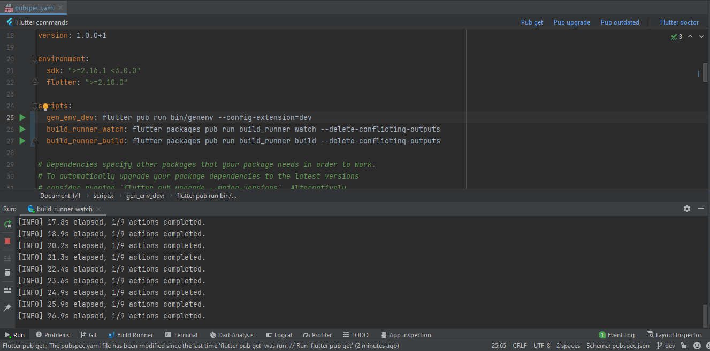
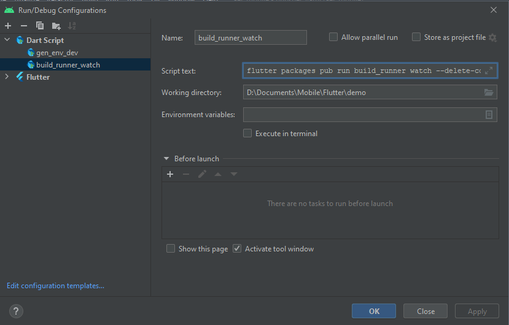

# Dart Scripts Runner

IntelliJ plugin to run scripts on pubspec.yaml for Dart projects

## Using

Write your custom script in the `scripts` property of the `pubspec.yaml` file.

Dart Scripts Runner will add a run button on each script line.
Click that button to run the script.

